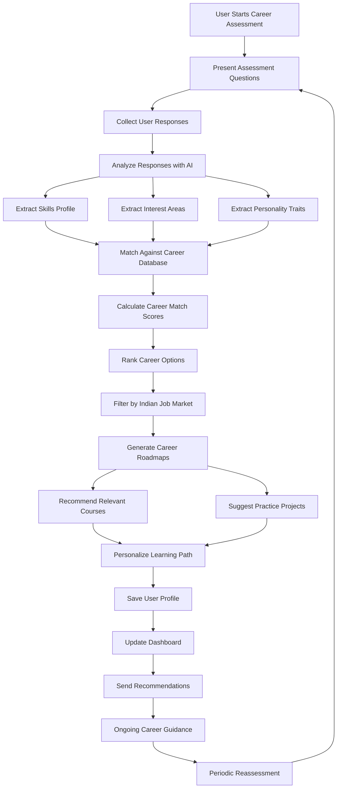
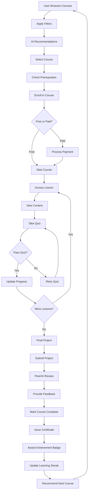
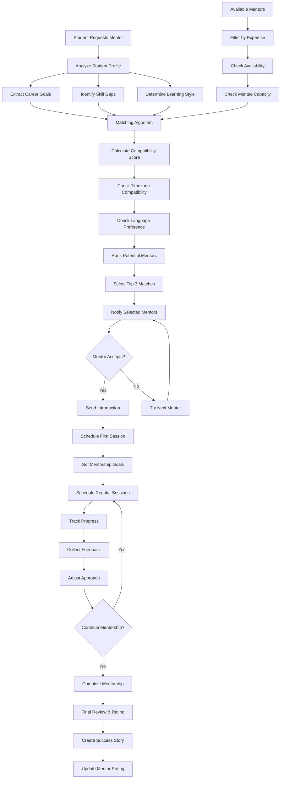
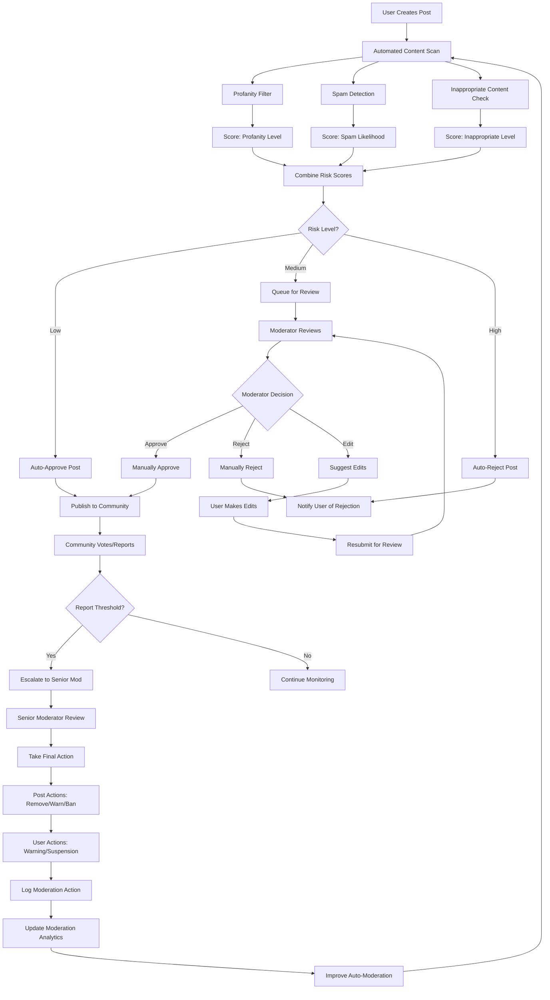
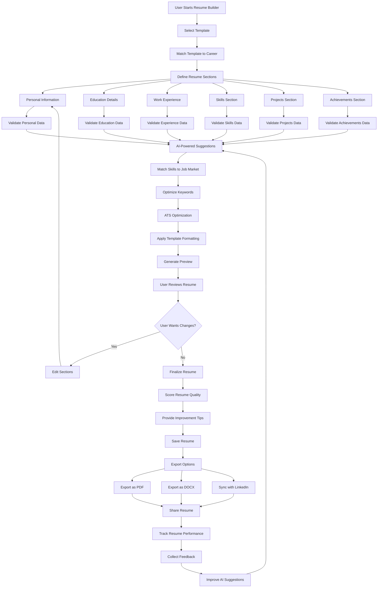
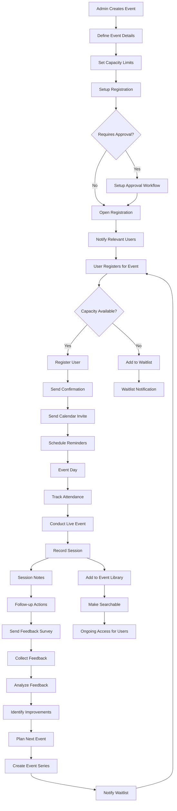
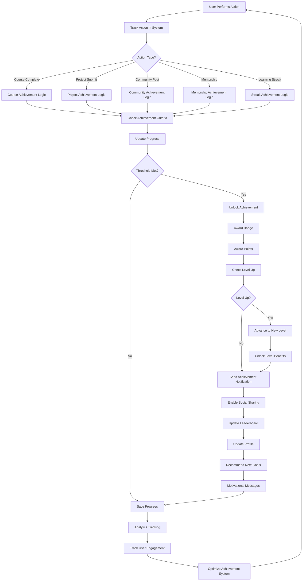
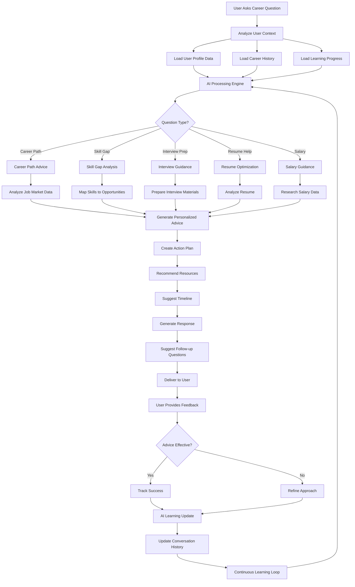
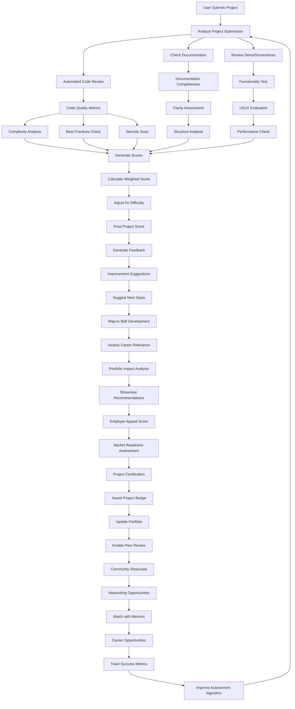
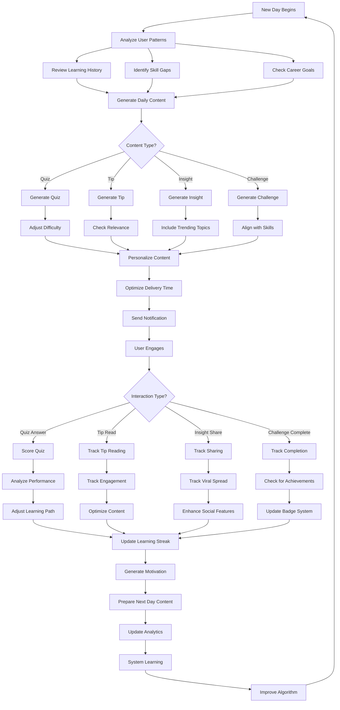

# CareerOS Business Logic Flows - Mermaid.js Diagrams

This document contains detailed business logic flow diagrams for specific CareerOS features.

## 1. Career Assessment & Recommendation Engine

## 2. Learning Management System Flow

## 3. Mentorship Matching Algorithm

## 4. Community Moderation Workflow

## 5. Resume Builder Logic Flow

## 6. Event Management System

## 7. Achievement & Gamification System

## 8. AI-Powered Career Coach Flow

## 9. Project Portfolio Assessment

## 10. Daily Learning Bytes System

These detailed business logic flows provide comprehensive insights into how each major feature of the CareerOS platform operates, from user interactions to system responses and continuous improvement loops.