# CareerOS System Architecture - Mermaid.js Diagrams

This document contains comprehensive Mermaid.js diagrams for the entire CareerOS platform architecture.

## 1. High-Level System Architecture

## 2. User Authentication Flow

## 3. Role-Based Access Control (RBAC)

## 4. Database Schema Architecture

## 5. API Routes Architecture

## 6. Frontend Component Architecture

## 7. Request Processing Flow

## 8. State Management Architecture

## 9. Error Handling System

```mermaid
graph TB
    subgraph "Error Types"
        VALIDATION[Validation Errors<br/>Zod Schema]
        DATABASE[Database Errors<br/>Postgres/Redis]
        AUTH[Authentication Errors<br/>JWT/OAuth]
        NETWORK[Network Errors<br/>API Calls]
        SYSTEM[System Errors<br/>Server Issues]
    end
    
    subgraph "Error Handlers"
        GLOBAL[Global Error Handler<br/>Express Middleware]
        FRONTEND[Frontend Error Boundary<br/>React Error Boundary]
        LOGGER[Admin Logger<br/>Structured Logging]
    end
    
    subgraph "Error Responses"
        JSON_ERROR[JSON Error Response<br/>Structured Format]
        USER_MESSAGE[User-Friendly Message<br/>Toast Notifications]
        ADMIN_LOG[Admin Log Entry<br/>Monitoring]
    end
    
    subgraph "Recovery Strategies"
        RETRY[Retry Logic<br/>Exponential Backoff]
        FALLBACK[Fallback Systems<br/>Redis → Memory]
        GRACEFUL[Graceful Degradation<br/>Feature Flags]
    end
    
    VALIDATION --> GLOBAL
    DATABASE --> GLOBAL
    AUTH --> GLOBAL
    NETWORK --> FRONTEND
    SYSTEM --> GLOBAL
    
    GLOBAL --> JSON_ERROR
    GLOBAL --> LOGGER
    FRONTEND --> USER_MESSAGE
    LOGGER --> ADMIN_LOG
    
    DATABASE --> FALLBACK
    NETWORK --> RETRY
    SYSTEM --> GRACEFUL
```

## 10. User Journey Flows

## 11. Data Flow Architecture

## 12. Security Architecture

This comprehensive set of Mermaid.js diagrams covers all major aspects of the CareerOS platform architecture, from high-level system design to detailed implementation flows. Each diagram provides a different perspective on the system's complexity and interconnections.