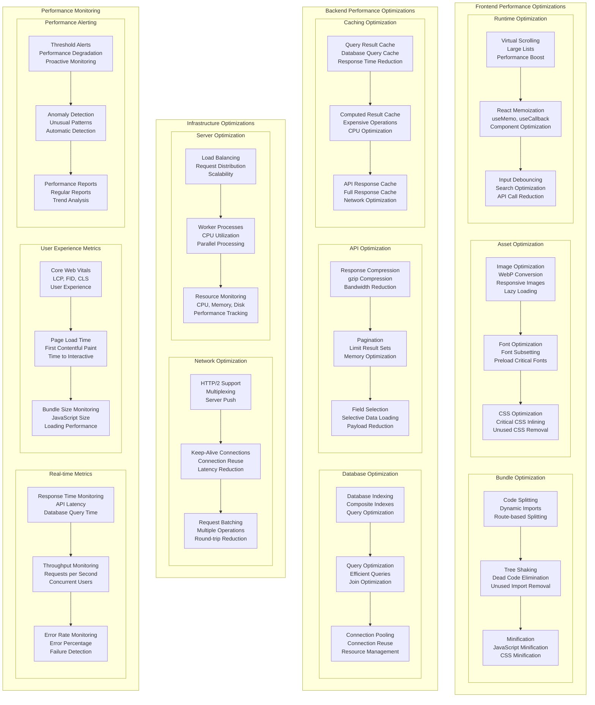

# CareerOS Technical Implementation - Mermaid.js Diagrams

This document contains detailed technical implementation diagrams for the CareerOS platform.

## 1. Complete System Component Diagram

```mermaid
graph TB
    subgraph "Frontend Layer"
        subgraph "React Application"
            PAGES[Pages Layer<br/>Dashboard, Auth, Learning]
            COMPONENTS[Components Layer<br/>UI Components, Forms]
            HOOKS[Hooks Layer<br/>Custom Hooks, State]
            UTILS[Utils Layer<br/>Helpers, Validators]
        end
        
        subgraph "State Management"
            REACT_QUERY[React Query<br/>Server State]
            LOCAL_STATE[Local State<br/>Component State]
            GLOBAL_CONTEXT[Global Context<br/>Auth, Theme]
        end
        
        subgraph "UI Framework"
            SHADCN[ShadCN UI<br/>Component Library]
            TAILWIND[Tailwind CSS<br/>Styling]
            FRAMER[Framer Motion<br/>Animations]
        end
    end
    
    subgraph "Backend Layer"
        subgraph "Express Server"
            ROUTES_LAYER[Routes Layer<br/>API Endpoints]
            MIDDLEWARE_LAYER[Middleware Layer<br/>Auth, Validation]
            CONTROLLERS[Controllers<br/>Business Logic]
            SERVICES[Services Layer<br/>External APIs]
        end
        
        subgraph "Authentication System"
            JWT_SERVICE[JWT Service<br/>Token Management]
            OAUTH_SERVICE[OAuth Service<br/>Social Login]
            RBAC_SERVICE[RBAC Service<br/>Role Management]
            MFA_SERVICE[MFA Service<br/>2FA Implementation]
        end
        
        subgraph "Data Access Layer"
            STORAGE_INTERFACE[Storage Interface<br/>IStorage]
            DATABASE_STORAGE[Database Storage<br/>PostgreSQL Operations]
            CACHE_LAYER[Cache Layer<br/>Redis Operations]
            FILE_STORAGE[File Storage<br/>Upload Management]
        end
    end
    
    subgraph "Database Layer"
        subgraph "PostgreSQL"
            USER_TABLES[User Tables<br/>users, user_roles]
            LEARNING_TABLES[Learning Tables<br/>courses, projects]
            COMMUNITY_TABLES[Community Tables<br/>posts, comments]
            SYSTEM_TABLES[System Tables<br/>sessions, logs]
        end
        
        subgraph "Redis Cache"
            SESSION_CACHE[Session Cache<br/>User Sessions]
            DATA_CACHE[Data Cache<br/>API Responses]
            RATE_LIMIT_CACHE[Rate Limit Cache<br/>Request Tracking]
        end
    end
    
    subgraph "External Services"
        subgraph "AI Services"
            OPENAI_API[OpenAI API<br/>AI Features]
            CAREER_AI[Career AI<br/>Recommendations]
            CONTENT_AI[Content AI<br/>Generation]
        end
        
        subgraph "Communication Services"
            EMAIL_SERVICE[Email Service<br/>Nodemailer]
            SMS_SERVICE[SMS Service<br/>Notifications]
            PUSH_SERVICE[Push Service<br/>Notifications]
        end
        
        subgraph "Third-Party APIs"
            GOOGLE_API[Google APIs<br/>OAuth, Calendar]
            GITHUB_API[GitHub API<br/>OAuth, Repos]
            LINKEDIN_API[LinkedIn API<br/>Profile Sync]
        end
    end
    
    subgraph "Infrastructure Layer"
        subgraph "Security"
            SECURITY_MIDDLEWARE[Security Middleware<br/>Headers, CORS]
            RATE_LIMITER[Rate Limiter<br/>Request Throttling]
            INPUT_VALIDATOR[Input Validator<br/>Sanitization]
            ERROR_HANDLER[Error Handler<br/>Global Handling]
        end
        
        subgraph "Monitoring"
            ADMIN_LOGGER[Admin Logger<br/>System Logs]
            PERFORMANCE_MONITOR[Performance Monitor<br/>Metrics]
            HEALTH_CHECK[Health Check<br/>System Status]
        end
    end
    
    PAGES --> COMPONENTS
    COMPONENTS --> HOOKS
    HOOKS --> UTILS
    PAGES --> REACT_QUERY
    REACT_QUERY --> LOCAL_STATE
    LOCAL_STATE --> GLOBAL_CONTEXT
    SHADCN --> TAILWIND
    TAILWIND --> FRAMER
    
    ROUTES_LAYER --> MIDDLEWARE_LAYER
    MIDDLEWARE_LAYER --> CONTROLLERS
    CONTROLLERS --> SERVICES
    JWT_SERVICE --> OAUTH_SERVICE
    OAUTH_SERVICE --> RBAC_SERVICE
    RBAC_SERVICE --> MFA_SERVICE
    
    STORAGE_INTERFACE --> DATABASE_STORAGE
    DATABASE_STORAGE --> CACHE_LAYER
    CACHE_LAYER --> FILE_STORAGE
    
    USER_TABLES --> LEARNING_TABLES
    LEARNING_TABLES --> COMMUNITY_TABLES
    COMMUNITY_TABLES --> SYSTEM_TABLES
    SESSION_CACHE --> DATA_CACHE
    DATA_CACHE --> RATE_LIMIT_CACHE
    
    OPENAI_API --> CAREER_AI
    CAREER_AI --> CONTENT_AI
    EMAIL_SERVICE --> SMS_SERVICE
    SMS_SERVICE --> PUSH_SERVICE
    GOOGLE_API --> GITHUB_API
    GITHUB_API --> LINKEDIN_API
    
    SECURITY_MIDDLEWARE --> RATE_LIMITER
    RATE_LIMITER --> INPUT_VALIDATOR
    INPUT_VALIDATOR --> ERROR_HANDLER
    ADMIN_LOGGER --> PERFORMANCE_MONITOR
    PERFORMANCE_MONITOR --> HEALTH_CHECK
    
    REACT_QUERY --> ROUTES_LAYER
    CONTROLLERS --> STORAGE_INTERFACE
    STORAGE_INTERFACE --> USER_TABLES
    CACHE_LAYER --> SESSION_CACHE
    SERVICES --> OPENAI_API
    SERVICES --> EMAIL_SERVICE
    SERVICES --> GOOGLE_API
    MIDDLEWARE_LAYER --> SECURITY_MIDDLEWARE
    CONTROLLERS --> ADMIN_LOGGER
```



## 2. Authentication & Authorization Implementation

```mermaid
graph TB
    subgraph "Authentication Flow"
        subgraph "Login Process"
            LOGIN_REQUEST[Login Request] --> AUTH_TYPE{Auth Type?}
            AUTH_TYPE -->|Email/Password| EMAIL_AUTH[Email Authentication]
            AUTH_TYPE -->|OAuth| OAUTH_AUTH[OAuth Authentication]
            AUTH_TYPE -->|2FA| MFA_AUTH[MFA Authentication]
            
            EMAIL_AUTH --> PASSWORD_VERIFY[Password Verification]
            OAUTH_AUTH --> TOKEN_EXCHANGE[Token Exchange]
            MFA_AUTH --> TOTP_VERIFY[TOTP Verification]
            
            PASSWORD_VERIFY --> SESSION_CREATE[Create Session]
            TOKEN_EXCHANGE --> SESSION_CREATE
            TOTP_VERIFY --> SESSION_CREATE
        end
        
        subgraph "Token Management"
            SESSION_CREATE --> JWT_GENERATE[Generate JWT]
            JWT_GENERATE --> ACCESS_TOKEN[Access Token]
            JWT_GENERATE --> REFRESH_TOKEN[Refresh Token]
            
            ACCESS_TOKEN --> TOKEN_STORAGE[Store in Database]
            REFRESH_TOKEN --> TOKEN_STORAGE
            
            TOKEN_STORAGE --> CLIENT_RESPONSE[Send to Client]
        end
        
        subgraph "Session Management"
            CLIENT_RESPONSE --> SESSION_STORAGE[Session Storage]
            SESSION_STORAGE --> REDIS_SESSION[Redis Session Store]
            SESSION_STORAGE --> DB_SESSION[Database Session Store]
            
            REDIS_SESSION --> SESSION_VALIDATION[Session Validation]
            DB_SESSION --> SESSION_VALIDATION
        end
    end
    
    subgraph "Authorization Flow"
        subgraph "Role-Based Access"
            REQUEST_AUTH[Authenticated Request] --> EXTRACT_TOKEN[Extract JWT Token]
            EXTRACT_TOKEN --> VERIFY_TOKEN[Verify Token]
            VERIFY_TOKEN --> DECODE_CLAIMS[Decode Claims]
            
            DECODE_CLAIMS --> USER_ROLES[Extract User Roles]
            USER_ROLES --> PERMISSION_CHECK[Check Permissions]
            PERMISSION_CHECK --> RESOURCE_ACCESS[Resource Access Check]
            
            RESOURCE_ACCESS --> AUTHORIZED{Authorized?}
            AUTHORIZED -->|Yes| GRANT_ACCESS[Grant Access]
            AUTHORIZED -->|No| DENY_ACCESS[Deny Access]
        end
        
        subgraph "Permission Matrix"
            STUDENT_PERMS[Student Permissions<br/>Read Own Data]
            MENTOR_PERMS[Mentor Permissions<br/>Read + Mentor Actions]
            MODERATOR_PERMS[Moderator Permissions<br/>Community Management]
            ADMIN_PERMS[Admin Permissions<br/>Full System Access]
            
            PERMISSION_CHECK --> STUDENT_PERMS
            PERMISSION_CHECK --> MENTOR_PERMS
            PERMISSION_CHECK --> MODERATOR_PERMS
            PERMISSION_CHECK --> ADMIN_PERMS
        end
    end
    
    subgraph "Security Measures"
        subgraph "Token Security"
            JWT_SIGNING[JWT Signing<br/>Secret Key]
            TOKEN_EXPIRY[Token Expiry<br/>Time-based]
            REFRESH_ROTATION[Refresh Token Rotation]
            
            JWT_SIGNING --> TOKEN_EXPIRY
            TOKEN_EXPIRY --> REFRESH_ROTATION
        end
        
        subgraph "Session Security"
            SECURE_COOKIES[Secure Cookies<br/>HttpOnly, Secure]
            CSRF_PROTECTION[CSRF Protection<br/>Token Validation]
            SESSION_TIMEOUT[Session Timeout<br/>Idle Detection]
            
            SECURE_COOKIES --> CSRF_PROTECTION
            CSRF_PROTECTION --> SESSION_TIMEOUT
        end
    end
```



## 3. Database Schema Implementation

```mermaid
graph TB
    subgraph "Core User System"
        USERS[users table<br/>id, username, email, password_hash<br/>profile_image_url, created_at, updated_at<br/>email_verified, two_factor_secret]
        
        USER_ROLES[user_roles table<br/>id, user_id, role_name<br/>assigned_at, assigned_by, is_active]
        
        SESSIONS[sessions table<br/>sid, sess, expire<br/>Session storage for Express]
        
        USERS --> USER_ROLES
        USERS --> SESSIONS
    end
    
    subgraph "Learning Management"
        COURSES[courses table<br/>id, title, description, category<br/>tags, is_free, price, difficulty_level<br/>instructor, duration_hours, curriculum]
        
        ENROLLMENTS[enrollments table<br/>id, user_id, course_id<br/>enrolled_at, progress_percentage<br/>completed_at, rating, review]
        
        PROJECTS[projects table<br/>id, title, description, category<br/>difficulty, tech_stack, requirements<br/>deliverables, created_at, updated_at]
        
        USER_PROJECTS[user_projects table<br/>id, user_id, project_id<br/>started_at, completed_at, status<br/>github_url, live_url, feedback]
        
        QUIZ_RESULTS[quiz_results table<br/>id, user_id, quiz_type<br/>answers, score, total_questions<br/>completed_at]
        
        USERS --> ENROLLMENTS
        COURSES --> ENROLLMENTS
        USERS --> USER_PROJECTS
        PROJECTS --> USER_PROJECTS
        USERS --> QUIZ_RESULTS
    end
    
    subgraph "Community System"
        COMMUNITIES[communities table<br/>id, name, description, category<br/>rules, created_at, created_by, is_active]
        
        COMMUNITY_MEMBERS[community_members table<br/>id, community_id, user_id<br/>role, joined_at, is_active]
        
        POSTS[posts table<br/>id, user_id, community_id<br/>title, content, tags<br/>upvotes, downvotes, created_at<br/>updated_at, is_moderated]
        
        COMMENTS[comments table<br/>id, post_id, user_id<br/>content, created_at, updated_at]
        
        USERS --> COMMUNITIES
        COMMUNITIES --> COMMUNITY_MEMBERS
        USERS --> COMMUNITY_MEMBERS
        COMMUNITIES --> POSTS
        USERS --> POSTS
        POSTS --> COMMENTS
        USERS --> COMMENTS
    end
    
    subgraph "Career Development"
        RESUMES[resumes table<br/>id, user_id, template_type<br/>resume_data, created_at, updated_at]
        
        SOFT_SKILLS[soft_skills table<br/>id, name, description, category<br/>skill_type, assessment_criteria, created_at]
        
        USER_SOFT_SKILLS[user_soft_skills table<br/>id, user_id, soft_skill_id<br/>current_level, target_level<br/>progress_data, last_updated]
        
        ACHIEVEMENTS[achievements table<br/>id, name, description, category<br/>criteria, badge_url, points, created_at]
        
        USER_ACHIEVEMENTS[user_achievements table<br/>id, user_id, achievement_id<br/>earned_at, progress_data]
        
        USERS --> RESUMES
        USERS --> USER_SOFT_SKILLS
        SOFT_SKILLS --> USER_SOFT_SKILLS
        USERS --> USER_ACHIEVEMENTS
        ACHIEVEMENTS --> USER_ACHIEVEMENTS
    end
    
    subgraph "Event System"
        EVENTS[events table<br/>id, title, description, type<br/>start_time, end_time, location<br/>max_participants, requires_registration<br/>created_by, created_at]
        
        USER_EVENTS[user_events table<br/>id, user_id, event_id<br/>registered_at, attendance_status<br/>rating, feedback]
        
        USERS --> EVENTS
        USERS --> USER_EVENTS
        EVENTS --> USER_EVENTS
    end
    
    subgraph "Analytics & Logging"
        ADMIN_LOGS[admin_logs table<br/>id, user_id, level, category<br/>action, details, metadata<br/>timestamp, ip_address]
        
        USER_ANALYTICS[user_analytics table<br/>id, user_id, metric_type<br/>metric_value, recorded_at]
        
        SYSTEM_METRICS[system_metrics table<br/>id, metric_name, metric_value<br/>recorded_at, metadata]
        
        USERS --> ADMIN_LOGS
        USERS --> USER_ANALYTICS
    end
```



## 4. API Endpoint Implementation

```mermaid
graph TB
    subgraph "Authentication Endpoints"
        AUTH_REGISTER[POST /api/auth/register<br/>Register new user<br/>Body: username, email, password<br/>Response: User data + JWT]
        
        AUTH_LOGIN[POST /api/auth/login<br/>User login<br/>Body: email, password<br/>Response: JWT tokens]
        
        AUTH_LOGOUT[POST /api/auth/logout<br/>User logout<br/>Headers: Authorization<br/>Response: Success message]
        
        AUTH_REFRESH[POST /api/auth/refresh<br/>Refresh access token<br/>Body: refresh_token<br/>Response: New access token]
        
        AUTH_ME[GET /api/auth/me<br/>Get current user<br/>Headers: Authorization<br/>Response: User data]
        
        AUTH_2FA_SETUP[POST /api/auth/2fa/setup<br/>Setup 2FA<br/>Headers: Authorization<br/>Response: QR code + secret]
        
        AUTH_2FA_VERIFY[POST /api/auth/2fa/verify<br/>Verify 2FA code<br/>Body: code<br/>Response: Success + backup codes]
        
        AUTH_OAUTH_GOOGLE[GET /api/auth/oauth/google<br/>Google OAuth initiation<br/>Response: Redirect to Google]
        
        AUTH_OAUTH_GITHUB[GET /api/auth/oauth/github<br/>GitHub OAuth initiation<br/>Response: Redirect to GitHub]
    end
    
    subgraph "User Management Endpoints"
        USER_PROFILE[GET /api/users/:id<br/>Get user profile<br/>Headers: Authorization<br/>Response: User profile data]
        
        USER_UPDATE[PUT /api/users/:id<br/>Update user profile<br/>Headers: Authorization<br/>Body: Updated fields<br/>Response: Updated user data]
        
        USER_AVATAR[POST /api/users/:id/avatar<br/>Upload avatar<br/>Headers: Authorization<br/>Body: FormData with image<br/>Response: Avatar URL]
        
        USER_ROLES[GET /api/users/:id/roles<br/>Get user roles<br/>Headers: Authorization<br/>Response: User roles array]
        
        USER_ASSIGN_ROLE[POST /api/users/:id/roles<br/>Assign role to user<br/>Headers: Authorization (Admin)<br/>Body: role_name<br/>Response: Success message]
    end
    
    subgraph "Learning Endpoints"
        COURSES_LIST[GET /api/courses<br/>Get courses list<br/>Query: category, tags, is_free<br/>Response: Courses array]
        
        COURSES_DETAIL[GET /api/courses/:id<br/>Get course details<br/>Response: Course data + curriculum]
        
        COURSES_ENROLL[POST /api/courses/:id/enroll<br/>Enroll in course<br/>Headers: Authorization<br/>Response: Enrollment data]
        
        COURSES_PROGRESS[GET /api/courses/:id/progress<br/>Get course progress<br/>Headers: Authorization<br/>Response: Progress data]
        
        COURSES_UPDATE_PROGRESS[PUT /api/courses/:id/progress<br/>Update course progress<br/>Headers: Authorization<br/>Body: progress_percentage<br/>Response: Updated progress]
        
        COURSES_STREAK[GET /api/courses/streak<br/>Get learning streak<br/>Headers: Authorization<br/>Response: Streak data]
        
        PROJECTS_LIST[GET /api/projects<br/>Get projects list<br/>Query: category, difficulty<br/>Response: Projects array]
        
        PROJECTS_DETAIL[GET /api/projects/:id<br/>Get project details<br/>Response: Project data]
        
        PROJECTS_SUBMIT[POST /api/projects/:id/submit<br/>Submit project<br/>Headers: Authorization<br/>Body: github_url, live_url<br/>Response: Submission data]
    end
    
    subgraph "Community Endpoints"
        COMMUNITIES_LIST[GET /api/communities<br/>Get communities list<br/>Response: Communities array]
        
        COMMUNITIES_DETAIL[GET /api/communities/:id<br/>Get community details<br/>Response: Community data + stats]
        
        COMMUNITIES_JOIN[POST /api/communities/:id/join<br/>Join community<br/>Headers: Authorization<br/>Response: Membership data]
        
        POSTS_LIST[GET /api/communities/:id/posts<br/>Get community posts<br/>Query: limit, offset<br/>Response: Posts array]
        
        POSTS_CREATE[POST /api/communities/:id/posts<br/>Create new post<br/>Headers: Authorization<br/>Body: title, content, tags<br/>Response: Post data]
        
        POSTS_DETAIL[GET /api/posts/:id<br/>Get post details<br/>Response: Post data + comments]
        
        POSTS_UPDATE[PUT /api/posts/:id<br/>Update post<br/>Headers: Authorization<br/>Body: Updated fields<br/>Response: Updated post]
        
        POSTS_MODERATE[PUT /api/posts/:id/moderate<br/>Moderate post<br/>Headers: Authorization (Moderator)<br/>Body: action, reason<br/>Response: Moderation result]
        
        COMMENTS_CREATE[POST /api/posts/:id/comments<br/>Create comment<br/>Headers: Authorization<br/>Body: content<br/>Response: Comment data]
    end
    
    subgraph "Career Development Endpoints"
        CAREER_ROADMAPS[GET /api/career/roadmaps<br/>Get career roadmaps<br/>Query: category<br/>Response: Roadmaps array]
        
        CAREER_QUIZ[POST /api/career/quiz<br/>Submit career quiz<br/>Headers: Authorization<br/>Body: answers<br/>Response: Results + recommendations]
        
        CAREER_RECOMMENDATIONS[GET /api/career/recommendations<br/>Get career recommendations<br/>Headers: Authorization<br/>Response: Personalized recommendations]
        
        RESUME_TEMPLATES[GET /api/career/resume-templates<br/>Get resume templates<br/>Response: Templates array]
        
        RESUME_BUILD[POST /api/career/resume<br/>Build resume<br/>Headers: Authorization<br/>Body: template_type, resume_data<br/>Response: Resume data]
        
        RESUME_EXPORT[GET /api/career/resume/:id/export<br/>Export resume<br/>Headers: Authorization<br/>Query: format (pdf, docx)<br/>Response: File download]
        
        MOCK_INTERVIEWS[GET /api/career/mock-interviews<br/>Get mock interview questions<br/>Headers: Authorization<br/>Query: role, level<br/>Response: Interview questions]
    end
    
    subgraph "Analytics Endpoints"
        ANALYTICS_DASHBOARD[GET /api/analytics/dashboard<br/>Get dashboard analytics<br/>Headers: Authorization<br/>Response: Dashboard metrics]
        
        ANALYTICS_PROGRESS[GET /api/analytics/progress<br/>Get progress analytics<br/>Headers: Authorization<br/>Response: Progress metrics]
        
        ANALYTICS_ENGAGEMENT[GET /api/analytics/engagement<br/>Get engagement analytics<br/>Headers: Authorization<br/>Response: Engagement metrics]
        
        ANALYTICS_PLATFORM[GET /api/analytics/platform-stats<br/>Get platform statistics<br/>Headers: Authorization (Admin)<br/>Response: Platform metrics]
    end
    
    subgraph "Admin Endpoints"
        ADMIN_USERS[GET /api/admin/users<br/>Get all users<br/>Headers: Authorization (Admin)<br/>Query: role, status<br/>Response: Users array]
        
        ADMIN_EVENTS[GET /api/admin/events<br/>Get all events<br/>Headers: Authorization (Admin)<br/>Response: Events array]
        
        ADMIN_CREATE_EVENT[POST /api/admin/events<br/>Create event<br/>Headers: Authorization (Admin)<br/>Body: Event data<br/>Response: Event created]
        
        ADMIN_MODERATION[GET /api/admin/moderation<br/>Get moderation queue<br/>Headers: Authorization (Admin)<br/>Response: Moderation items]
        
        ADMIN_CONTENT[GET /api/admin/content<br/>Get content management<br/>Headers: Authorization (Admin)<br/>Response: Content items]
        
        ADMIN_SYSTEM[GET /api/admin/system<br/>Get system status<br/>Headers: Authorization (Admin)<br/>Response: System metrics]
    end
    
    subgraph "File Upload Endpoints"
        UPLOAD_AVATAR[POST /api/upload/avatar<br/>Upload avatar image<br/>Headers: Authorization<br/>Body: FormData<br/>Response: File URL]
        
        UPLOAD_PROJECT[POST /api/upload/project<br/>Upload project files<br/>Headers: Authorization<br/>Body: FormData<br/>Response: File URLs]
        
        UPLOAD_RESUME[POST /api/upload/resume<br/>Upload resume document<br/>Headers: Authorization<br/>Body: FormData<br/>Response: File URL]
    end
```

## 5. Middleware Implementation Stack

```mermaid
graph TB
    subgraph "Request Processing Pipeline"
        REQUEST[Incoming HTTP Request] --> CORS_MIDDLEWARE[CORS Middleware<br/>Cross-Origin Resource Sharing]
        CORS_MIDDLEWARE --> SECURITY_HEADERS[Security Headers Middleware<br/>X-Frame-Options, X-XSS-Protection<br/>Content-Security-Policy]
        
        SECURITY_HEADERS --> RATE_LIMITING[Rate Limiting Middleware<br/>Request Throttling<br/>IP-based Limiting]
        
        RATE_LIMITING --> BODY_PARSER[Body Parser Middleware<br/>JSON, URL-encoded<br/>File upload handling]
        
        BODY_PARSER --> INPUT_SANITIZATION[Input Sanitization Middleware<br/>XSS Prevention<br/>HTML Sanitization]
        
        INPUT_SANITIZATION --> SQL_INJECTION_CHECK[SQL Injection Prevention<br/>Parameter Validation<br/>Query Sanitization]
        
        SQL_INJECTION_CHECK --> AUTHENTICATION[Authentication Middleware<br/>JWT Token Validation<br/>Session Verification]
        
        AUTHENTICATION --> AUTHORIZATION[Authorization Middleware<br/>RBAC Implementation<br/>Permission Checking]
        
        AUTHORIZATION --> VALIDATION[Input Validation Middleware<br/>Zod Schema Validation<br/>Type Checking]
        
        VALIDATION --> ROUTE_HANDLER[Route Handler<br/>Business Logic<br/>Database Operations]
        
        ROUTE_HANDLER --> RESPONSE_PROCESSING[Response Processing<br/>Data Formatting<br/>Error Handling]
        
        RESPONSE_PROCESSING --> LOGGING[Logging Middleware<br/>Request Logging<br/>Performance Metrics]
        
        LOGGING --> RESPONSE[HTTP Response]
    end
    
    subgraph "Error Handling Pipeline"
        ERROR_OCCURRED[Error Occurred] --> ERROR_CATEGORIZATION[Error Categorization<br/>Validation, Database, Auth<br/>System, Network]
        
        ERROR_CATEGORIZATION --> ERROR_LOGGING[Error Logging<br/>Admin Logger<br/>Structured Logging]
        
        ERROR_LOGGING --> ERROR_RESPONSE[Error Response Generation<br/>User-friendly Messages<br/>Error Codes]
        
        ERROR_RESPONSE --> FALLBACK_HANDLING[Fallback Handling<br/>Graceful Degradation<br/>Service Recovery]
        
        FALLBACK_HANDLING --> ERROR_RECOVERY[Error Recovery<br/>Retry Logic<br/>Circuit Breaker]
        
        ERROR_RECOVERY --> FINAL_RESPONSE[Final Error Response<br/>Consistent Format<br/>Security Safe]
    end
    
    subgraph "Security Middleware Details"
        subgraph "Authentication Layer"
            JWT_VERIFICATION[JWT Token Verification<br/>Signature Validation<br/>Expiry Check]
            SESSION_VALIDATION[Session Validation<br/>Redis Session Store<br/>Session Expiry]
            USER_CONTEXT[User Context Creation<br/>User Data Loading<br/>Role Assignment]
            
            JWT_VERIFICATION --> SESSION_VALIDATION
            SESSION_VALIDATION --> USER_CONTEXT
        end
        
        subgraph "Authorization Layer"
            ROLE_EXTRACTION[Role Extraction<br/>User Roles Loading<br/>Permission Mapping]
            RESOURCE_CHECKING[Resource Access Checking<br/>Ownership Validation<br/>Permission Verification]
            ACTION_AUTHORIZATION[Action Authorization<br/>CRUD Permissions<br/>Operation Validation]
            
            ROLE_EXTRACTION --> RESOURCE_CHECKING
            RESOURCE_CHECKING --> ACTION_AUTHORIZATION
        end
        
        subgraph "Input Security"
            XSS_PREVENTION[XSS Prevention<br/>Script Tag Filtering<br/>Attribute Sanitization]
            INJECTION_PREVENTION[Injection Prevention<br/>SQL Injection<br/>Command Injection]
            FILE_VALIDATION[File Validation<br/>Type Checking<br/>Size Limits<br/>Malware Scanning]
            
            XSS_PREVENTION --> INJECTION_PREVENTION
            INJECTION_PREVENTION --> FILE_VALIDATION
        end
    end
```



## 6. Caching Implementation Strategy

```mermaid
graph TB
    subgraph "Multi-Layer Caching Architecture"
        subgraph "Browser Cache Layer"
            BROWSER_CACHE[Browser Cache<br/>Static Assets<br/>HTML, CSS, JS, Images]
            SERVICE_WORKER[Service Worker<br/>Offline Support<br/>Background Sync]
            LOCAL_STORAGE[Local Storage<br/>User Preferences<br/>Temporary Data]
            
            BROWSER_CACHE --> SERVICE_WORKER
            SERVICE_WORKER --> LOCAL_STORAGE
        end
        
        subgraph "CDN Cache Layer"
            CDN_CACHE[CDN Cache<br/>Global Distribution<br/>Static Asset Delivery]
            EDGE_CACHE[Edge Cache<br/>Geographic Distribution<br/>Low Latency Access]
            
            CDN_CACHE --> EDGE_CACHE
        end
        
        subgraph "Application Cache Layer"
            REDIS_CACHE[Redis Cache<br/>Session Data<br/>API Responses<br/>Computed Results]
            MEMORY_CACHE[Memory Cache<br/>Hot Data<br/>Frequently Accessed]
            QUERY_CACHE[Query Cache<br/>Database Results<br/>Computed Queries]
            
            REDIS_CACHE --> MEMORY_CACHE
            MEMORY_CACHE --> QUERY_CACHE
        end
        
        subgraph "Database Cache Layer"
            POSTGRES_CACHE[PostgreSQL Cache<br/>Query Plan Cache<br/>Buffer Cache]
            CONNECTION_POOL[Connection Pool<br/>Connection Reuse<br/>Performance Optimization]
            
            POSTGRES_CACHE --> CONNECTION_POOL
        end
    end
    
    subgraph "Cache Strategies"
        subgraph "Read Strategies"
            CACHE_ASIDE[Cache Aside<br/>Load on Demand<br/>Application Managed]
            READ_THROUGH[Read Through<br/>Cache Managed<br/>Automatic Loading]
            
            CACHE_ASIDE --> READ_THROUGH
        end
        
        subgraph "Write Strategies"
            WRITE_THROUGH[Write Through<br/>Synchronous Write<br/>Consistency Guaranteed]
            WRITE_BEHIND[Write Behind<br/>Asynchronous Write<br/>Performance Optimized]
            WRITE_AROUND[Write Around<br/>Write Direct to DB<br/>Cache on Read]
            
            WRITE_THROUGH --> WRITE_BEHIND
            WRITE_BEHIND --> WRITE_AROUND
        end
        
        subgraph "Invalidation Strategies"
            TTL_EXPIRY[TTL Expiry<br/>Time-based Expiration<br/>Automatic Cleanup]
            EXPLICIT_INVALIDATION[Explicit Invalidation<br/>Manual Cache Clearing<br/>Event-driven]
            CACHE_WARMING[Cache Warming<br/>Proactive Loading<br/>Performance Optimization]
            
            TTL_EXPIRY --> EXPLICIT_INVALIDATION
            EXPLICIT_INVALIDATION --> CACHE_WARMING
        end
    end
    
    subgraph "Cache Implementation Details"
        subgraph "Redis Configuration"
            REDIS_CLUSTER[Redis Cluster<br/>High Availability<br/>Distributed Cache]
            REDIS_PERSISTENCE[Redis Persistence<br/>RDB + AOF<br/>Data Durability]
            REDIS_MONITORING[Redis Monitoring<br/>Performance Metrics<br/>Health Checks]
            
            REDIS_CLUSTER --> REDIS_PERSISTENCE
            REDIS_PERSISTENCE --> REDIS_MONITORING
        end
        
        subgraph "Cache Keys Structure"
            USER_CACHE[User Cache Keys<br/>user:{id}:profile<br/>user:{id}:roles]
            COURSE_CACHE[Course Cache Keys<br/>course:{id}:details<br/>user:{id}:enrollments]
            ANALYTICS_CACHE[Analytics Cache Keys<br/>analytics:platform:stats<br/>analytics:user:{id}:metrics]
            
            USER_CACHE --> COURSE_CACHE
            COURSE_CACHE --> ANALYTICS_CACHE
        end
        
        subgraph "Cache Fallback"
            REDIS_AVAILABLE[Redis Available?<br/>Connection Check<br/>Health Status]
            MEMORY_FALLBACK[Memory Fallback<br/>In-Memory Storage<br/>Temporary Cache]
            NO_CACHE_FALLBACK[No Cache Fallback<br/>Direct DB Access<br/>Degraded Performance]
            
            REDIS_AVAILABLE --> MEMORY_FALLBACK
            MEMORY_FALLBACK --> NO_CACHE_FALLBACK
        end
    end
```

## 7. Performance Optimization Implementation



This comprehensive technical implementation documentation provides detailed insights into every aspect of the CareerOS platform's architecture, from frontend components to backend services, database design, and performance optimization strategies.